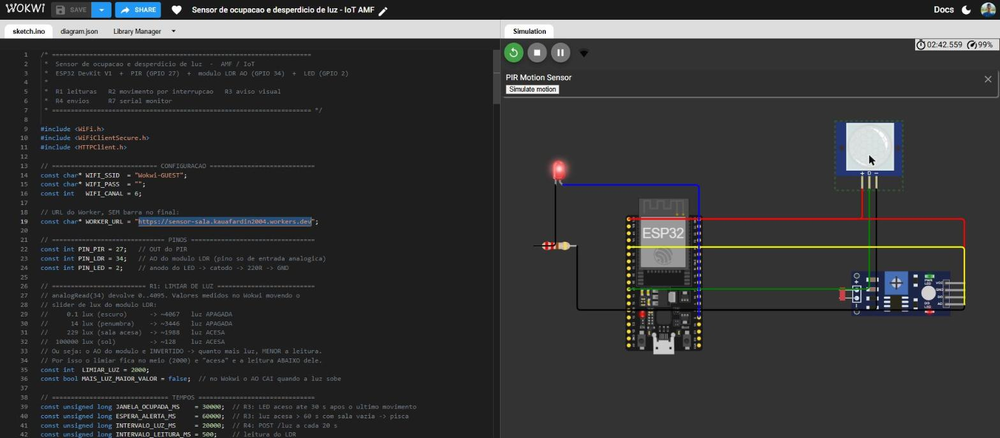
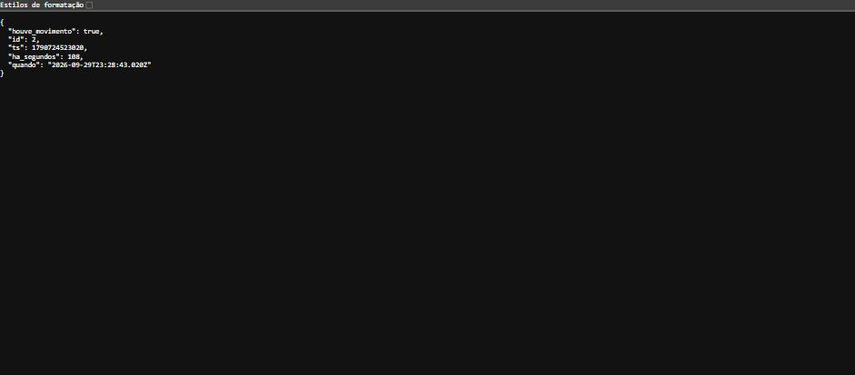
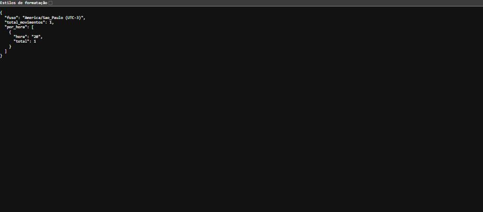
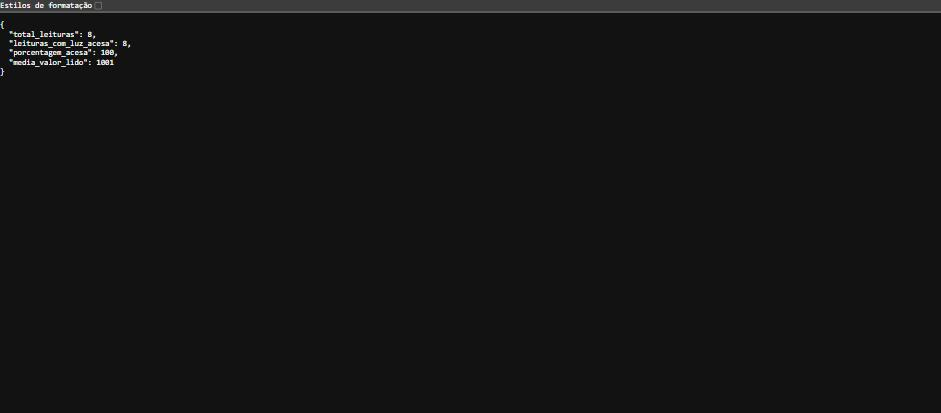
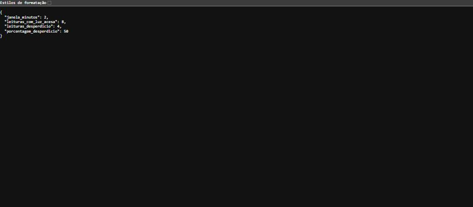
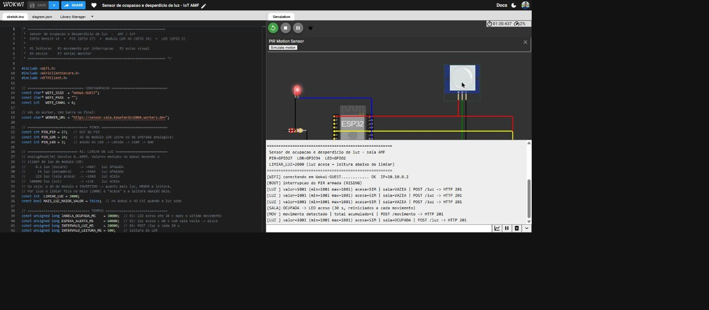

# ENTREGA — Sensor de ocupação e desperdício de luz

**Disciplina:** IoT (Internet of Things) — Prof. Leonam V. Hemann
**Aluno:** Kauã Fardin

---

## 1. Links

| Item | Link |
|---|---|
| Projeto no Wokwi | https://wokwi.com/projects/476540969195274241 |
| URL do Worker | https://sensor-sala.kauafardin2004.workers.dev |

### Arquivos deste repositório

| Arquivo | O que é |
|---|---|
| `sketch.ino` | firmware do ESP32 (R1 a R4 e R7) |
| `diagram.json` | circuito do Wokwi (mesmo do link acima) |
| `worker.js` | Worker da Cloudflare com os 2 POST e os 4 GET |
| `schema.sql` | `CREATE TABLE` das tabelas `movimentos` e `luz` |
| `wrangler.toml` | ligação do Worker com o banco D1 |
| `prints/` | as imagens usadas na seção 8 |

---

## 2. Montagem no Wokwi (R1)

Peças: **ESP32 DevKit**, **PIR Motion Sensor**, **Photoresistor (LDR) Sensor** e **LED** com resistor de 220 Ω.

| Componente | Ligação |
|---|---|
| PIR | VCC → 3V3, GND → GND, OUT → **GPIO 27** |
| LDR (módulo) | VCC → 3V3, GND → GND, AO → **GPIO 34** (DO não é usado) |
| LED | ânodo no **GPIO 2**, cátodo pelo resistor de 220 Ω até o GND |

> **Dois detalhes do `diagram.json` desta placa (`board-esp32-devkit-c-v4`):**
>
> 1. Os pinos são `"esp:27"`, `"esp:34"` e `"esp:2"` — só o número do GPIO.
>    `"esp:D2"` **não** é o GPIO 2: é o pino D2 do cartão SD. E `"esp:D27"` / `"esp:D34"`
>    nem existem — o Wokwi descarta esses fios em silêncio, sem nenhum aviso de erro.
> 2. As duas linhas do `$serialMonitor` precisam estar nas `connections`, senão o painel
>    do **Serial Monitor não aparece** na tela:
>
> ```json
> [ "esp:TX", "$serialMonitor:RX", "" ],
> [ "esp:RX", "$serialMonitor:TX", "" ]
> ```
>
> (usando `TX`/`RX`, os pinos do conversor USB-serial — com `TX0`/`RX0` o painel não abre)

### Limiar de luz

`analogRead(34)` devolve de 0 a 4095. Valores medidos no simulador, movendo o slider de lux do LDR:

| Iluminação | Leitura do AO | Interpretação |
|---|---|---|
| 0,1 lux (escuro) | ≈ 4067 | luz apagada |
| 14 lux (penumbra) | ≈ 3446 | luz apagada |
| 229 lux (sala acesa) | ≈ 1988 | luz acesa |
| 100 000 lux (sol) | ≈ 128 | luz acesa |

➡ **`LIMIAR_LUZ = 2000`** (meio do caminho entre a luz baixa e a luz alta).

> **O AO do módulo LDR do Wokwi é invertido: quanto mais luz, menor a leitura.**
> Por isso a sala é considerada com a **luz acesa** quando a leitura fica **abaixo** do limiar
> (`MAIS_LUZ_MAIOR_VALOR = false` no sketch). O Serial ainda imprime `min=` e `max=` a cada
> envio, para conferir os dois extremos durante a apresentação.

---

## 3. Banco D1 (R5)

### CREATE TABLE

```sql
CREATE TABLE IF NOT EXISTS movimentos (
  id INTEGER PRIMARY KEY AUTOINCREMENT,
  ts INTEGER NOT NULL
);

CREATE TABLE IF NOT EXISTS luz (
  id    INTEGER PRIMARY KEY AUTOINCREMENT,
  valor INTEGER NOT NULL,
  acesa INTEGER NOT NULL,
  ts    INTEGER NOT NULL
);

CREATE INDEX IF NOT EXISTS idx_movimentos_ts ON movimentos (ts);
CREATE INDEX IF NOT EXISTS idx_luz_ts        ON luz (ts);
```

O `ts` é sempre gravado **pelo Worker**, com `Date.now()` (milissegundos), nunca pelo ESP32.
Todas as inserções usam `prepare()` + `bind()`:

```js
await env.DB.prepare("INSERT INTO movimentos (ts) VALUES (?)").bind(ts).run();
await env.DB.prepare("INSERT INTO luz (valor, acesa, ts) VALUES (?, ?, ?)")
            .bind(valor, acesa, ts).run();
```

---

## 4. Endpoints (R4 e R6)

| Método | Rota | O que faz | Status |
|---|---|---|---|
| POST | `/movimento` | grava um movimento detectado pelo PIR | 201 |
| POST | `/luz` | grava `{ "valor": 3120, "acesa": 1 }` | 201 / 400 |
| GET | `/ultimo-movimento` | há quantos segundos houve o último movimento | 200 |
| GET | `/por-hora` | quantos movimentos em cada hora do dia | 200 |
| GET | `/luz-resumo` | total de leituras, quantas com luz acesa e a % | 200 |
| GET | `/desperdicio` | leituras de luz acesa sem movimento nos 2 min anteriores | 200 |

Método errado na rota certa devolve **405**; rota inexistente devolve **404**; JSON inválido em `/luz` devolve **400**.

### Consultas SQL

**`/por-hora`** — quantos movimentos em cada hora do dia (horário de Brasília):

```sql
SELECT strftime('%H', ts / 1000, 'unixepoch', '-3 hours') AS hora,
       COUNT(*)                                            AS total
  FROM movimentos
 GROUP BY hora
 ORDER BY hora;
```

**`/luz-resumo`** — total de leituras, quantas com luz acesa e a porcentagem:

```sql
SELECT COUNT(*)                          AS total_leituras,
       COALESCE(SUM(acesa), 0)           AS leituras_acesa,
       COALESCE(ROUND(AVG(valor), 1), 0) AS media_valor
  FROM luz;
```

> A porcentagem sai de `leituras_acesa * 100 / total_leituras`, calculada no Worker.

**`/desperdicio`** — leituras com a luz acesa e **nenhum** movimento nos 2 minutos anteriores:

```sql
SELECT COUNT(*) AS leituras_desperdicio
  FROM luz
 WHERE acesa = 1
   AND NOT EXISTS (
         SELECT 1
           FROM movimentos m
          WHERE m.ts BETWEEN luz.ts - 120000 AND luz.ts
       );
```

**`/ultimo-movimento`**:

```sql
SELECT id, ts FROM movimentos ORDER BY ts DESC LIMIT 1;
```
(`ha_segundos = (Date.now() - ts) / 1000`)

---

## 5. Como o firmware atende cada requisito

- **R2 — interrupção:** `attachInterrupt(digitalPinToInterrupt(27), isrMovimento, RISING)`.
  A ISR faz **só** `movimentosPendentes++` e guarda `millis()`, dentro de um `portENTER_CRITICAL_ISR`.
  O `loop()` lê e zera esse contador de uma vez e envia **um POST por evento pendente** — se chegar
  movimento enquanto o ESP32 está enviando, ele continua sendo contado e é enviado logo depois.
  Nenhum HTTP acontece dentro da interrupção.
- **R3 — aviso visual:**
  - sala **ocupada** = houve movimento nos últimos **30 s** (o tempo reinicia a cada movimento) → LED **aceso**;
  - sala **vazia** + luz **acesa** há mais de **60 s** → LED **piscando** (alerta de desperdício);
  - caso contrário → LED apagado.
- **R4 — envios:** `POST /movimento` a cada movimento e `POST /luz` a cada **20 s**, via
  `WiFiClientSecure` + `client.setInsecure()` passado ao `HTTPClient` (HTTPS da Cloudflare).
- **R7 — Serial:** cada movimento com o total acumulado, cada leitura de luz (com min/max),
  o estado da sala (`OCUPADA` / `VAZIA` / `VAZIA/DESPERDICIO`) e o código HTTP de cada envio.

---

## 6. Publicação do Worker (já feita)

O Worker está no ar em **https://sensor-sala.kauafardin2004.workers.dev**, ligado ao banco D1
`sensor_sala` (`database_id = f507611a-dfea-4cc5-9d81-36d72317cb9f`). Comandos usados:

```bash
npx wrangler@3 login
npx wrangler@3 d1 create sensor_sala
npx wrangler@3 d1 execute sensor_sala --remote --file=./schema.sql
npx wrangler@3 deploy
```

Para publicar de novo depois de mudar o `worker.js`, basta `npx wrangler@3 deploy` nesta pasta.

### Testes feitos nos endpoints

| Requisição | Resposta |
|---|---|
| `POST /movimento` | **201** `{"ok":true,"id":1,"ts":...}` |
| `POST /luz` `{"valor":1200,"acesa":1}` | **201** `{"ok":true,"id":1,...}` |
| `GET /ultimo-movimento` | **200** `{"houve_movimento":true,"ha_segundos":1,...}` |
| `GET /por-hora` | **200** `{"por_hora":[{"hora":"20","total":1}]}` (hora de Brasília) |
| `GET /luz-resumo` | **200** `{"total_leituras":1,"leituras_com_luz_acesa":1,"porcentagem_acesa":100}` |
| `GET /desperdicio` | **200** contou 1 de 3 leituras — só a que ficou fora da janela de 2 min |
| `GET /movimento` (método errado) | **405** |
| `GET /rota-inexistente` | **404** |
| `POST /luz` com corpo inválido | **400** |

> Esses primeiros testes foram feitos com `curl` e com uma linha inserida à mão (com `ts`
> fora da janela de 2 minutos), só para conferir a subconsulta do `/desperdicio`. Essas
> linhas foram apagadas depois — **os números da seção 8 vêm todos do ESP32 no simulador**.

Para zerar o banco antes de apresentar:

```bash
npx wrangler@3 d1 execute sensor_sala --remote --command "DELETE FROM luz; DELETE FROM movimentos;"
```

Teste rápido dos endpoints:

```bash
curl -X POST https://sensor-sala.kauafardin2004.workers.dev/movimento
curl -X POST https://sensor-sala.kauafardin2004.workers.dev/luz -H "content-type: application/json" -d "{\"valor\":3120,\"acesa\":1}"
curl https://sensor-sala.kauafardin2004.workers.dev/ultimo-movimento
curl https://sensor-sala.kauafardin2004.workers.dev/por-hora
curl https://sensor-sala.kauafardin2004.workers.dev/luz-resumo
curl https://sensor-sala.kauafardin2004.workers.dev/desperdicio
```

---

## 7. Roteiro da apresentação para a Carla

1. Rodar a simulação e mostrar o Wi-Fi conectado no Serial.
2. **Clicar no PIR** → aparece `[MOV ] movimento detectado | total acumulado=1 | POST /movimento -> HTTP 201`
   e o **LED acende**.
3. Abrir `/ultimo-movimento` → mostra que o movimento chegou no D1 (há poucos segundos).
4. **Deixar a luz alta** no slider do LDR e não clicar mais no PIR.
   Depois de 30 s a sala fica VAZIA; passando 60 s de luz acesa o **LED começa a piscar**.
5. Depois de ~2 minutos, abrir `/desperdicio` → o número de leituras de desperdício **aumenta**.
6. Mostrar `/por-hora` (movimentos por hora do dia) e `/luz-resumo` (total, acesas e porcentagem).

---

## 8. Prints

Todos os dados abaixo saíram do ESP32 rodando no Wokwi, enviados pelo Wi-Fi do simulador
para o Worker e gravados no D1 — nenhum foi inserido à mão.

### Aviso visual na sala (R3)



Simulação em 02:42, último movimento em 01:28: a sala está **vazia há mais de 30 s** e a
**luz continua acesa**, então o LED está **piscando** (alerta de desperdício).

### `GET /ultimo-movimento` — há quanto tempo foi o último movimento



```json
{ "houve_movimento": true, "id": 2, "ts": 1790724523020,
  "ha_segundos": 108, "quando": "2026-09-29T23:28:43.020Z" }
```

### `GET /por-hora` — movimentos em cada hora do dia



```json
{ "fuso": "America/Sao_Paulo (UTC-3)", "total_movimentos": 1,
  "por_hora": [ { "hora": "20", "total": 1 } ] }
```

### `GET /luz-resumo` — total de leituras, quantas acesas e a porcentagem



```json
{ "total_leituras": 8, "leituras_com_luz_acesa": 8,
  "porcentagem_acesa": 100, "media_valor_lido": 1001 }
```

O valor 1001 é a leitura do LDR com os 500 lux padrão do simulador — abaixo do
`LIMIAR_LUZ = 2000`, ou seja, **luz acesa** (lembrando que o AO é invertido).

### `GET /desperdicio` — luz acesa sem movimento nos 2 minutos anteriores



```json
{ "janela_minutos": 2, "leituras_com_luz_acesa": 8,
  "leituras_desperdicio": 4, "porcentagem_desperdicio": 50 }
```

Das 8 leituras com a luz acesa, **4 não tiveram nenhum movimento nos 2 minutos anteriores** —
exatamente as que aconteceram depois que o movimento das 23:28 saiu da janela.

### Serial Monitor (R7)



Saída real da simulação, com o LED aceso no circuito no mesmo instante:

```
 Sensor de ocupacao e desperdicio de luz - sala AMF
 PIR=GPIO27  LDR=GPIO34  LED=GPIO2
 LIMIAR_LUZ=2000 (luz acesa = leitura abaixo do limiar)
[WIFI] conectando em Wokwi-GUEST............ OK  IP=10.10.0.2
[BOOT] interrupcao do PIR armada (RISING)
[LUZ ] valor=1001 (min=1001 max=1001) acesa=SIM | sala=VAZIA   | POST /luz -> HTTP 201
[LUZ ] valor=1001 (min=1001 max=1001) acesa=SIM | sala=VAZIA   | POST /luz -> HTTP 201
[LUZ ] valor=1001 (min=1001 max=1001) acesa=SIM | sala=VAZIA   | POST /luz -> HTTP 201
[SALA] OCUPADA -> LED aceso (30 s, reiniciados a cada movimento)
[MOV ] movimento detectado | total acumulado=1 | POST /movimento -> HTTP 201
[LUZ ] valor=1001 (min=1001 max=1001) acesa=SIM | sala=OCUPADA | POST /luz -> HTTP 201
```

Aparecem os quatro itens que o R7 pede: **cada movimento com o total acumulado**, **cada
leitura de luz**, o **estado da sala** (VAZIA / OCUPADA / desperdício) e o **código HTTP**
de cada envio.
